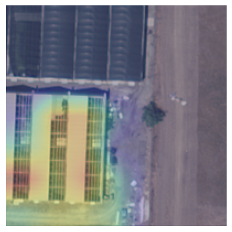
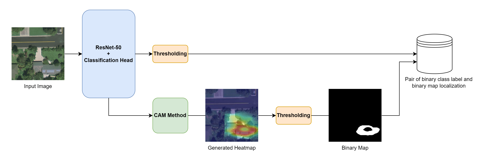

# Exploring Different Levels of Supervision for Detecting and Localizing Solar Panels on Remote Sensing Imagery

This repository contains the complete codebase for exploring supervision for solar panels. The repository consists of four main parts:
1. Code for editing and loading and using the dataset
2. Code to train and evaluate a classifier (default: ResNet-50)
3. Code to train and evaluate a object detector (default: Faster R-CNN)
4. Code to train and evaluate variational autoencoder (default: custom architecture based on ResNet-50)

The paper is available [here](https://arxiv.org/abs/2309.10421).

The full thesis (extended report) is available [here](https://scripties.uba.uva.nl/search?id=record_53567).

## Abstract
This study investigates object presence detection and localization in remote sensing imagery, focusing on solar panel recognition. We explore different levels of supervision, evaluating three models: a fully supervised object detector, a weakly supervised image classifier with CAM-based localization, and a minimally supervised anomaly detector. The classifier excels in binary presence detection (0.79 F1-score), while the object detector (0.72) offers precise localization. The anomaly detector requires more data for viable performance. Fusion of model results shows potential accuracy gains. CAM impacts localization modestly, with GradCAM, GradCAM++, and HiResCAM yielding superior results. Notably, the classifier remains robust with less data, in contrast to the object detector.

## Classification Detections and Localizations
    

## Object Detection Detections and Localizations
    

## Variational Auto-Encoder Detections and Localizations
    

## Pipeline Overview
# Classification Pipeline

# Object Detection Pipeline

# ariational Auto-Encoder Pipeline

## How to Use
Simply install the requirements and download the full Distributed Solar Photovoltaic Array Location and Extent Data Set for Remote Sensing Object Identification [here](https://figshare.com/articles/dataset/Distributed_Solar_Photovoltaic_Array_Location_and_Extent_Data_Set_for_Remote_Sensing_Object_Identification/3385780/4), make sure to include all the images of the cities Fresno, Stockton, Modesto and Oxnard. Put metadata (jsons, txt, geojson) in /data and images in /data/images. 

Then run the preprocessing.py in the data folder.

Now you are good to go! Train a model of choice using one of the train.py files, it will save the best model using your hyperparams (configurable in the .py file). When you are done training you can evaluate it using the matching evaluate.py file. Make sure to have a folder for your saved checkpoints (default: /saved_models)!
